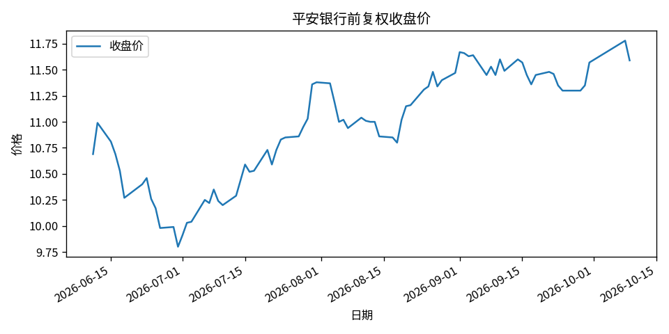
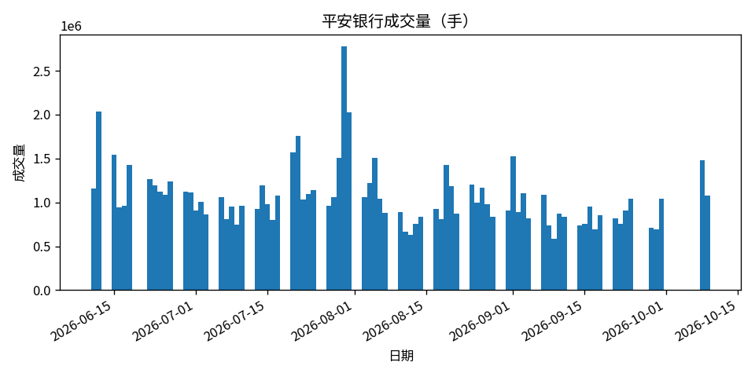
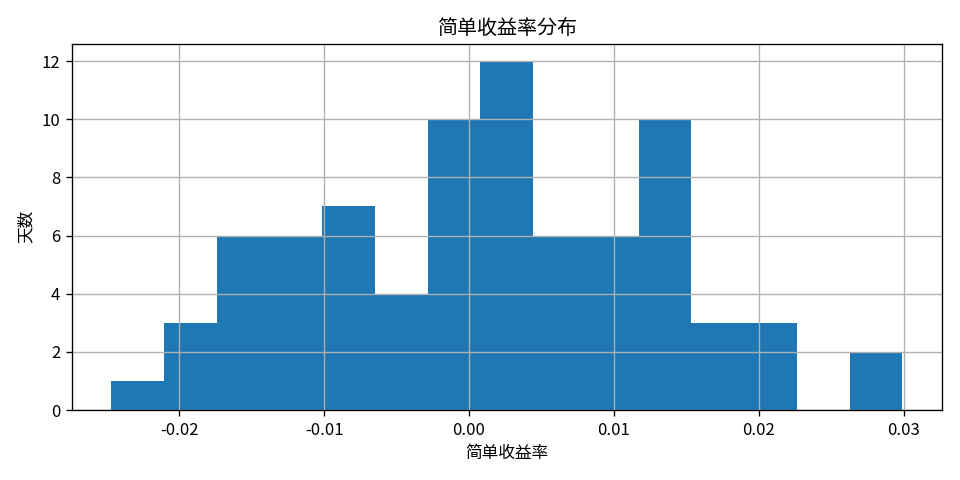
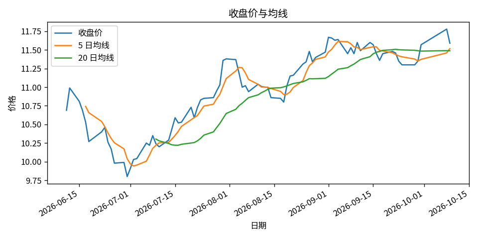

# 可视化与时间序列

日 K 存成 CSV 之后，先画出来再往下算。日期是否排序、价格有没有跳空、均线从哪一天才有值，图上都能看见。这一章安装 Matplotlib，用平安银行 80 个交易日的前复权行情画出收盘价、成交量、均线和收益率分布。

数据文件是 `examples/fintech/sz000001_dayk.csv`，从 2026-06-11 到 2026-10-09，列名是 `date,open,high,low,close,volume`。它由 [腾讯日 K](data.md) 保存而来，成交量单位是手。下面的四张图由 `examples/fintech/plot_prices.py` 写入 `docs/fintech/images/`。按本章代码在自己的目录里运行时，图片则写在当前目录。

## 安装 Matplotlib

画图用 `matplotlib`，读表仍用 `pandas`，对数收益用 `numpy`。在项目目录里建虚拟环境再安装，不要用 `sudo pip install`。

```
python -m venv .venv
```

激活：

* Windows：`.venv\Scripts\activate`
* macOS / Linux：`source .venv/bin/activate`

激活后，命令行前面通常出现 `(.venv)`。然后安装：

```
python -m pip install matplotlib pandas numpy
```

安装结束时，pip 会列出这几个包和它们的版本号。版本号以自己机器上的打印为准。确认能导入：

```
python -c "import matplotlib; print(matplotlib.__version__)"
```

能打印出版本号，就说明库已经装进当前环境。本书生成下面几张图时，这条命令打印的是 `3.10.0`。

在程序里引用的是：

```python
import matplotlib.pyplot as plt
```

这行是 Python 代码，不是命令行。

没有图形桌面时，`plt.show()` 打不开窗口。作业要交的是图片文件，所以在导入 `pyplot` 之前指定只写文件、不弹窗口：

```python
import matplotlib
matplotlib.use("Agg")
import matplotlib.pyplot as plt
```

`use("Agg")` 必须写在 `import matplotlib.pyplot` 之前。有桌面时可以再调用 `plt.show()` 看一眼，交作业仍以 `savefig` 写出的文件为准。

图中的中文使用本机字体。本书的图用的是 Noto Sans CJK。若标题变成方框，安装一种中文字体，或把标题改成英文。坐标上的曲线不受字体影响。

## 先读表、再排序

在 `examples/fintech/` 目录下运行：

```python
from pathlib import Path

import pandas as pd

csv_path = Path("sz000001_dayk.csv")
df = pd.read_csv(csv_path, parse_dates=["date"]).sort_values("date")
print(len(df), df["date"].iloc[0].date(), df["date"].iloc[-1].date())
```

```
80 2026-06-11 2026-10-09
```

`sort_values("date")` 放在收益率和均线之前。没有排序时，`pct_change()` 减到的就不是前一个交易日。

## 收盘价

```python
fig, ax = plt.subplots(figsize=(8, 4))
ax.plot(df["date"], df["close"], label="收盘价")
ax.set_title("平安银行前复权收盘价")
ax.set_xlabel("日期")
ax.set_ylabel("价格")
ax.legend()
fig.autofmt_xdate()
fig.tight_layout()
fig.savefig("close.png", dpi=120)
```

`plot` 的第一个参数是横轴，第二个是纵轴。`autofmt_xdate()` 把日期标签斜着放下，避免挤在一起。`tight_layout()` 留出边距，避免标题被切掉。`savefig` 把图写成当前目录下的 `close.png`。



这段行情从 6 月中旬的约 10.7 元附近下跌，7 月初接近 9.8 元，之后上升到 10 月上旬的约 11.7 元。最后一天 2026-10-09 的收盘价是 11.59。横轴按真实日期展开，周末和假期没有点，所以有的区间看起来疏一些。

## 成交量

```python
fig, ax = plt.subplots(figsize=(8, 4))
ax.bar(df["date"], df["volume"], width=1.0)
ax.set_title("平安银行成交量（手）")
ax.set_xlabel("日期")
ax.set_ylabel("成交量")
fig.autofmt_xdate()
fig.tight_layout()
fig.savefig("volume.png", dpi=120)
```

`bar` 画的是柱，不是把成交量连成线。纵轴旁的 `1e6` 表示刻度要乘以一百万，柱高 1.5 就是约 150 万手。



柱和柱之间的空白是非交易日。最高的一根出现在 8 月初，超过 250 万手。读这张图时同时看价格图：放量的日子，价格往往也在大幅变动。

## 简单收益和对数收益

```python
import numpy as np

df["ret"] = df["close"].pct_change()
df["log_ret"] = np.log(df["close"]).diff()
print(df["ret"].describe())
print(df[["date", "close", "ret", "log_ret"]].tail(1))
```

`pct_change()` 是简单收益率 \((P_t / P_{t-1}) - 1\)。`np.log(df["close"]).diff()` 是对数收益率 \(\ln(P_t / P_{t-1})\)。第一行没有前一天，两个结果都是空值。80 个收盘价得到 79 个收益率。

这 79 天的简单收益率：

| 统计量 | 数值 |
| --- | --- |
| 均值 | 0.001093 |
| 标准差 | 0.011870 |
| 最小 | −0.024691 |
| 最大 | 0.029918 |

最后一天收盘价从 11.78 到 11.59。简单收益率是 \(11.59 / 11.78 - 1 = -0.016129\)，对数收益率是 \(-0.016261\)。这一天跌了约 1.6%，两个数已经很接近。后面做波动率和蒙特卡洛时用对数收益，做净值曲线时用简单收益。

简单收益率的分布：

```python
fig, ax = plt.subplots(figsize=(8, 4))
df["ret"].dropna().hist(bins=15, ax=ax)
ax.set_title("简单收益率分布")
ax.set_xlabel("简单收益率")
ax.set_ylabel("天数")
fig.tight_layout()
fig.savefig("ret_hist.png", dpi=120)
```

`dropna()` 去掉第一行的空值，否则直方图会把空值算进去。`bins=15` 把区间分成 15 格。



多数交易日的涨跌落在 0 附近。左边最低约 −2.5%，右边最高约 3.0%，和上表的最小、最大一致。

## 5 日和 20 日均线

```python
df["ma5"] = df["close"].rolling(5).mean()
df["ma20"] = df["close"].rolling(20).mean()
print(df["ma5"].isna().sum(), df["ma20"].isna().sum())
print(df["ma5"].iloc[-1], df["ma20"].iloc[-1])
```

```
4 19
11.518 11.4885
```

`rolling(5)` 取最近 5 个交易日，含当天。前 4 行凑不满 5 天，`ma5` 是空值；前 19 行凑不满 20 天，`ma20` 是空值。最后一天的 5 日均线是 11.518，20 日均线是 11.4885。这里的「日」是交易日，不是日历日。

```python
fig, ax = plt.subplots(figsize=(8, 4))
ax.plot(df["date"], df["close"], label="收盘价")
ax.plot(df["date"], df["ma5"], label="5 日均线")
ax.plot(df["date"], df["ma20"], label="20 日均线")
ax.set_title("收盘价与均线")
ax.set_xlabel("日期")
ax.set_ylabel("价格")
ax.legend()
fig.autofmt_xdate()
fig.tight_layout()
fig.savefig("ma.png", dpi=120)
```



5 日均线从第 5 个交易日才出现，贴着收盘价走。20 日均线更平滑，起点更晚。上涨段里，收盘价多在 20 日均线之上；急跌时，5 日均线先跟着掉下来。

## 画图之前要核对的三件事

日期必须先排序，再计算 `pct_change` 和 `rolling`。停牌和节假日会使日期不连续，横轴用真实日期，不要把缺失的日历日填成价格。两只股票放在一起比较时，按日期对齐，不要按行号对齐。

## 课堂练习

1. 在虚拟环境里安装 Matplotlib，打印 `matplotlib.__version__`。
2. 用自己的至少 60 个交易日，画出收盘价和成交量，横轴是日期，图片用 `savefig` 保存。
3. 在同一张图上叠加 5 日、20 日均线，并写出两条均线开头各有多少个空值。
4. 画出简单收益率的直方图，标出样本里的最大跌幅和最大涨幅。
