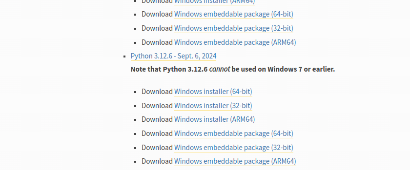
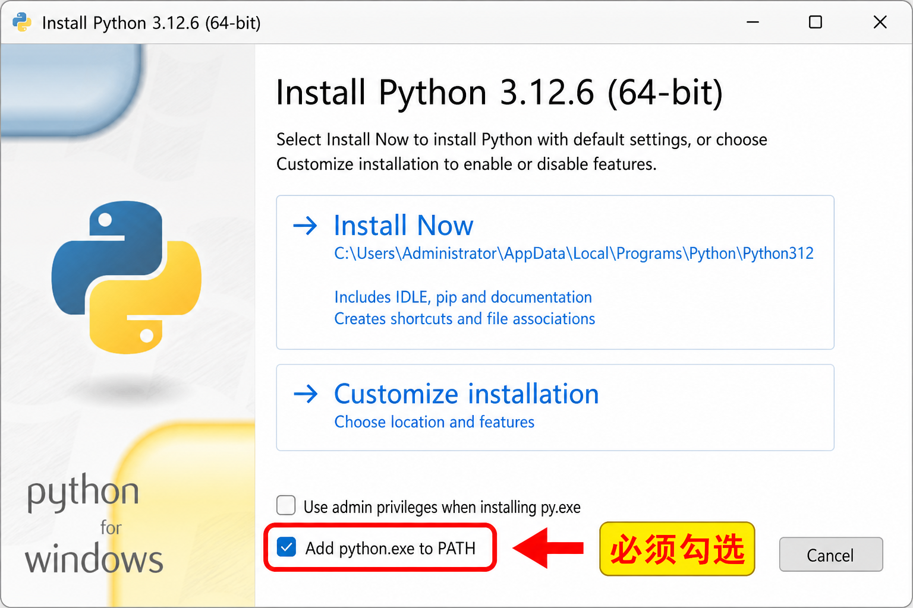
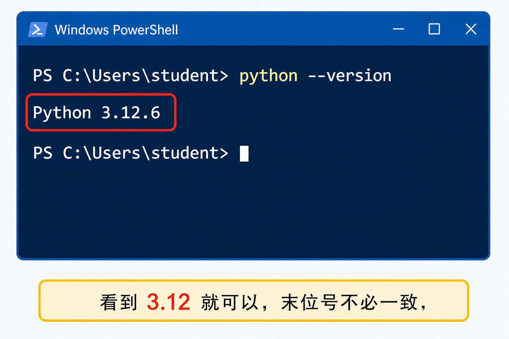
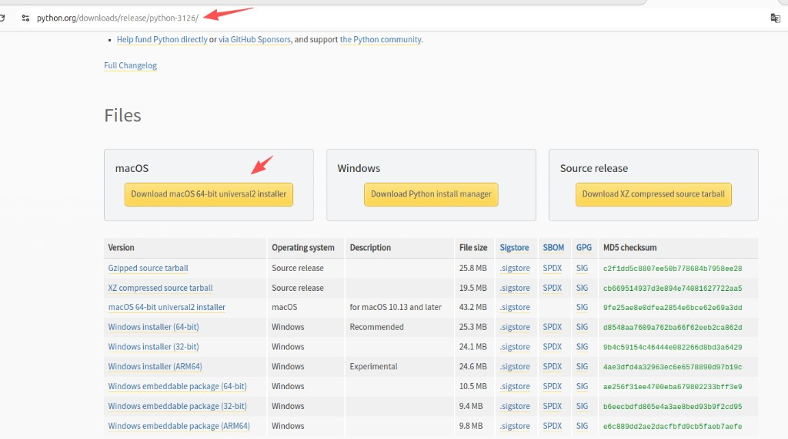
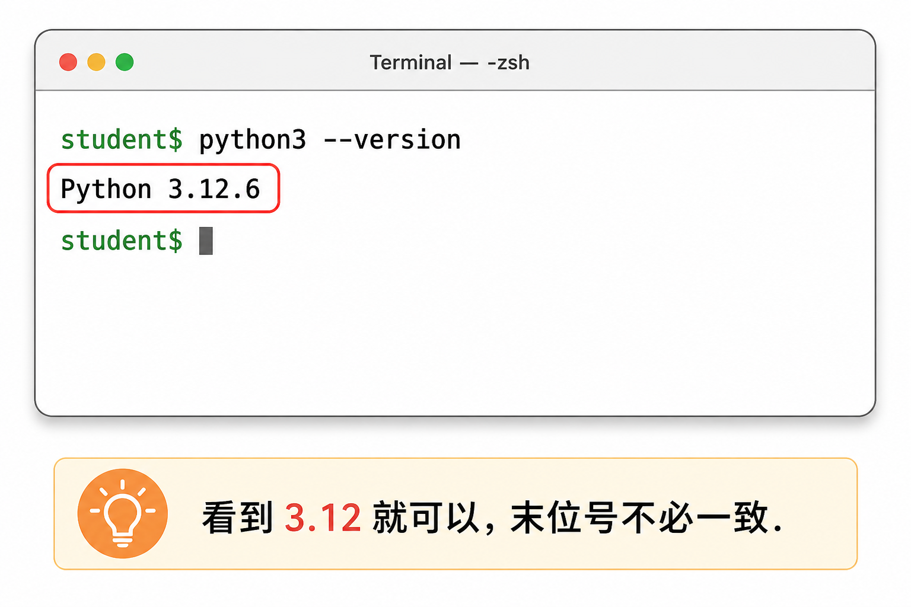

# 安装 Python 3.12 及以上

本教材按 Python 3.12 编写，3.13 也可以。安装后先确认版本，再开始写代码。

**版本号仅供参考。** 文中和配图用的是 `3.12.6`，只是当时官网的一个例子。你下载时请选官网当前提供的 **3.12 或更高** 版本（3.13 也可以）。末位号不必和书上一一对应：`3.12.6`、`3.12.10`、`3.13.x` 都可以用来学这套教材。

认准两件事即可：**64 位安装包**，以及 Windows 上勾选 **Add python.exe to PATH**。

## Windows

1. 打开 https://www.python.org/downloads/windows/
2. 在某个 3.12 或 3.13 的版本下面，点 **Windows installer (64-bit)**。下图以 `3.12.6` 为例，你页面上的日期和末位号可以不一样。

    

    普通电脑选 **64-bit** 即可，不要选 embeddable package。Python 3.12 不能用在 Windows 7 及更早系统上。

3. 安装时勾选 **Add python.exe to PATH**，再点 **Install Now**。这一步最容易漏，不勾选的话，后面在命令行里输入 `python` 会提示找不到命令。

    

4. 安装完成后，打开「命令提示符」或 PowerShell，输入：

```
python --version
```

看到 `Python 3.12.x` 或 `3.13.x` 就对了，例如：

```
Python 3.12.6
```



顺便确认包管理器：

```
python -m pip --version
```

## macOS

1. 打开 3.12.6 的发布页（示例地址，末位号可按官网最新版本改）：

    https://www.python.org/downloads/release/python-3126/

2. 在页面 **Files** 里，点黄色按钮 **Download macOS 64-bit universal2 installer**。要求 macOS 10.13 及以后。不要下 Windows 或 Source 那一栏。

    

    上图地址栏就是 `python.org/downloads/release/python-3126/`。如果你装的是更新的 3.12.x 或 3.13.x，把网址里的版本号换成对应发布页即可，按钮名字仍然是 **macOS 64-bit universal2 installer**。

3. 打开下载好的 `.pkg`，按安装向导点继续，直到完成。
4. 打开「终端」，执行：

```
python3 --version
```

看到 `Python 3.12.x` 或 `3.13.x` 就成功了，末位号不必和书上一样。



如果系统里还有旧的 `python`，请优先用 `python3`。

## Linux（以 Ubuntu 为例）

不同发行版命令不一样。Ubuntu 22.04 / 24.04 可以先看系统自带版本：

```
python3 --version
```

如果低于 3.12，再用发行版文档或官方安装包升到 3.12+。装完后同样执行：

```
python3 --version
python3 -m pip --version
```

## 建议同时准备虚拟环境

后面安装第三方库时，不要往系统 Python 里乱装。课程里统一用虚拟环境，详见 [安装模块（pip / venv）](../pip.md)。

接下来先搭学习目录，再写第一个程序：

* [附录一：学习目录和测试环境](appendix1.md)
* [开始](../start.md)
